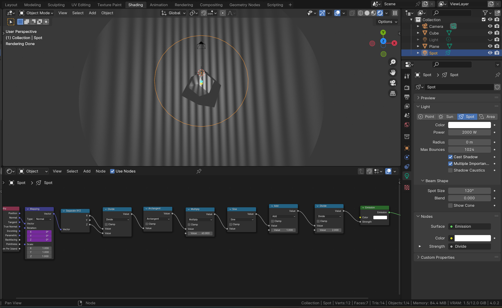

# Grading light projector in Blender

A shader generates grating in Blender.

The light intensity is a sine function of the incident angle. 
The shader uses artan and Normal vector to get incident angle,
and generates grating with sine function.

I added a driver linking the shader with rotation property,
so everything rotates when the instance rotates.

